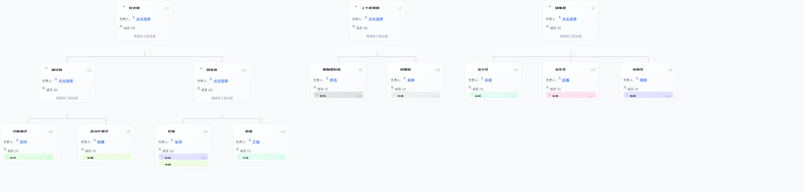

<div align="center">

# 组织罗盘 · OrgCompass

**从画组织架构，到看懂组织问题 —— 一款给 HRBP / 组织发展（OD）的专业工作台**

[English](#) · [中文](#) &nbsp;|&nbsp; **Web + Tauri 桌面双端** · **数据 100% 本地**

<div align="center">


</div>

</div>

---

## ✨ 你在用什么工具画组织架构？

传统的组织架构工具，只是一个"画框"——你可以拉几个方框、连几条线，但**画完就结束了**。你仍然要自己盯着图，去数每个部门管几个人、几个层级、有没有空岗、哪里超编。

**组织罗盘（OrgCompass）** 不一样。它把"画图"当成起点，把"看懂组织"当成终点：

> **不只是画得出来，更要看得懂。**

它把 HRBP 的实战判断，直接做进产品里——一张图，同时回答"这个组织长什么样"和"这个组织健不健康、该改哪"。

---

## 🧭 核心价值：从「画图」到「决策」

| 传统工具 | 组织罗盘 OrgCompass |
| --- | --- |
| 画一张静态组织树 | 画的同时自动算**健康度**，红/黄/绿灯实时判读 |
| 导出图片就完了 | 一键生成**组织优化建议**（20+ 条部门级、可落地） |
| 手动数编制、盯空岗 | **编制 vs 实际 vs 缺口**，含**职级成本**，一目了然 |
| 人搬来搬去靠脑补 | **拖拽批量移动 + 撤销**，像操作白板一样改组织 |

---

## 🚀 核心功能

### 1. 组织架构设计（不只是画图）
- **树状多级部门**（L1–L6），带**父子引导线**，层级从属一眼看清
- 部门卡片：名称、负责人、成员、**编制数**、**职级成本**
- 拖拽部门调整层级、拖拽员工到目标部门、框选/**批量移动**（可撤销）
- 双击改名、右键创建虚拟员工（兼岗）、负责人搜索选择
- **双指捏合缩放 / 双指滑动或空白区拖拽平移**（触控板友好，类地图手感）

### 2. 组织健康度分析（核心差异化）
- **L1 部门概览**：管理幅度、层级深度、管理者比、空岗率
- **红/黄/绿 阈值判读** + 一句话诊断
- **L3 编制 vs 实际 vs 缺口**（含职级成本）
- **自动优化建议**：基于指标生成 20+ 条**部门级**建议（如"XX 部门管理幅度偏窄，建议合并小组"）
- 一键导出**诊断报告**（指标卡 + 组织图 + 明细表，可打印/PDF/PNG）

### 3. 数据与协作
- 上传员工 / 组织架构 **Excel** 模板，一键重建结构
- **自动保存** + 项目文件（`.orgproj`）保存 / 打开（刷新不丢、可备份换机）
- **场景快照**：同一组织多版演练（基线 / 方案 A / 方案 B …）
- 导出 **PNG / Excel**

### 4. 内置行业模板 & 新手引导
- 互联网 / 制造 / 零售 / 医院科层，一键载入示例
- 三步新手引导 + 空状态引导，上手即用

---

## 🖼️ 界面预览



> 上图：真实的部门树渲染（含父子引导线、统一间距、父部门居中于子部门块）。

---

## 💻 运行方式

| 形态 | 适用场景 | 运行 |
| --- | --- | --- |
| **🌐 Web 版** | 浏览器直接用 / 部署静态托管 | `npm run dev` 或部署 `dist/` |
| **🖥️ Tauri 桌面版** | 本地安装，无需服务器，适合分发给同事 | `npm run tauri:build` 产出安装包 |

> 选桌面版：不需要服务器即可在本地运行，安装包约 5–10MB（Tauri 内核，远小于 Electron）。

---

## 🛠️ 技术栈

React 18 · TypeScript (strict) · Vite 6 · Tailwind CSS · @dnd-kit · Tauri 2 (Rust) · xlsx · html2canvas · Lucide React · Vitest

- **性能**：html2canvas / xlsx 动态导入，主包 852KB → 223KB（-74%）
- **质量**：158 单元测试全绿；`tsc -b --force` 零错误；ESLint 零错误；Rust `cargo check` 通过

---

## 🚦 快速开始

```bash
# 安装依赖
npm install

# Web 开发模式
npm run dev

# 构建 Web 生产版（dist/）
npm run build

# 代码检查 + 单元测试
npm run lint
npm run test
```

### Tauri 桌面版

> 前置：macOS 需 [Xcode Command Line Tools](https://developer.apple.com/xcode/) + [Rust](https://rustup.rs/)；Windows 需 [WebView2](https://developer.microsoft.com/microsoft-edge/webview2/)（Win11 自带）+ Rust。

```bash
npm run tauri:dev      # 桌面版开发（热重载）
npm run tauri:build    # 构建安装包（.dmg /.exe /.AppImage 等）
```

桌面版与 Web 版共用同一套前端代码：运行时自动检测 Tauri 环境，导出文件走原生"另存为"对话框（浏览器环境回退为下载）。

---

## 📁 目录结构

```
├── src/
│   ├── components/      # OrgChart / DepartmentCard / Sidebar / TopBar 等
│   ├── utils/           # excel / analytics / search / history / zoom / tauri
│   ├── types/           # 类型定义
│   ├── App.tsx          # 主应用
│   └── main.tsx         # 入口
├── src-tauri/           # Tauri 桌面端（Rust 主进程 + dialog/fs 插件）
├── docs/                # 设计文档 & 视觉素材
└── package.json
```

---

## 🔍 关键词

`组织罗盘` · `OrgCompass` · `组织架构设计` · `组织架构图` · `组织健康度分析` · `HRBP 工具` · `OD 组织发展` · `组织诊断` · `Org Chart` · `Organizational Design` · `Org Health` · `Tauri` · `React` · `Org Structure Designer`

---

## 📄 许可证

**Apache License 2.0** © 2026 [Max Hou (MaxHou-infinity)](https://github.com/MaxHou-infinity)

使用、修改或分发本项目（含衍生作品）时，**必须保留原作者版权声明与署名，并在修改文件上注明变更**。

- ✅ 允许：商用、修改、分发、专利授权
- 📌 要求：保留版权声明、注明修改、附上许可证副本
- 🚫 禁止：使用作者名义进行背书或推广

---

> **命名说明**：项目当前以「组织罗盘 OrgCompass」作为推荐名。若你希望正式改名为其它候选（见上），并同步更新仓库名 / `package.json` name / Tauri `productName` / `identifier`，请确认后我再执行完整改名（改仓库名会有链接重定向）。
